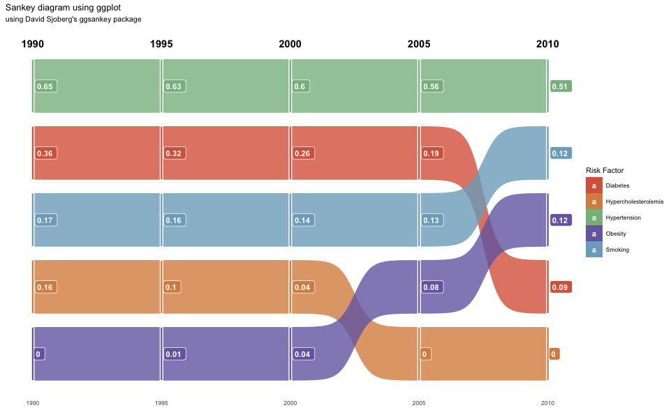

# SNsankeyPlotter

SNsankeyPlotter is an R package designed to plot a specific Sankey diagram based on predefined data.

## Approach

The package follows these steps:

1. **Data Structure**: The dataset is structured in a wide format, where each column represents data for a specific year and rows represent different risk factors.

2. **Data Transformation**: 
   - The dataset is transformed into a long format using the `gather` function from the `tidyr` package, enabling easier plotting with ggplot2.
   - A shifted version of the data is created to represent values for the next year, using the `lead` function.
   - Columns are renamed for clarity and convenience during plotting.

3. **Plotting**:
   - The plotting leverages the `ggsankey` package, which extends ggplot2's capabilities to allow for the creation of Sankey diagrams.
   - Factors (like "Obesity", "Diabetes", etc.) are color-coded for visual distinction.
   - Sankey flows represent the magnitude of each factor for each year, transitioning between years to show changes over time.

## Installation

Before installing `SNsankeyPlotter`, ensure you have the `ggsankey` package installed from GitHub:

```R
remotes::install_github("davidsjoberg/ggsankey")
```

## Dependencies

Before installing `SNsankeyPlotter`, ensure you have the `ggsankey` package installed from GitHub:

```R
remotes::install_github("davidsjoberg/ggsankey")
```

## Plotted Image

The following code was used to generate the plot as below: 

```R
remotes::install_github("davidsjoberg/ggsankey")
remotes::install_github("ShreyaNayak256/SNsankeyPlotter")
library('SNsankeyPlotter')
plot_sankey()
```


